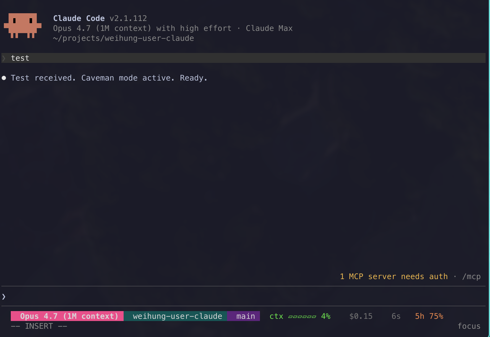

# weihung-user-claude

Personal user-root light agent system for Claude Code and Codex.

The repo keeps global behavior in version control, but deliberately separates:

- shared working agreements
- Claude-specific prompt, agents, and hooks
- Codex-specific prompt, subagents, rules, and hooks

The goal is to keep the user-root layer thin and stable, while leaving personal machine config such as credentials, MCP servers, model choices, and trusted project state under direct user control.

## Design

This repo follows a light split:

- `shared/`: cross-product principles that are stable across tools
- `claude/`: assets that only make sense for Claude Code
- `codex/`: assets that only make sense for Codex

That split matters because the products do not expose the same primitives:

- Claude uses `CLAUDE.md`, `~/.claude/settings.json`, and Markdown subagents
- Codex uses `AGENTS.md`, `rules/*.rules`, `hooks.json`, and TOML subagents

Trying to force both products through one identical file model creates unnecessary coupling.

For the longer design boundary, including what this repo should borrow from larger toolkits such as ECC and what it should avoid, see [docs/design-principles.md](docs/design-principles.md).

## Layout

```text
CLAUDE.md                          # thin Claude root prompt, imports shared fragments
AGENTS.md                          # thin Codex root prompt
shared/
  communication.md
  engineering.md
  context-management.md
claude/
  agents/
    security-reviewer.md
    silent-failure-hunter.md
  hooks/
    log-notification.sh
    log-stop.sh
  statusline.sh
codex/
  agents/
    docs-researcher.toml
    safety-reviewer.toml
  rules/
    default.rules
  hooks/
    log-session-start.sh
    log-stop.sh
  hooks.json
rules/
  clean-architecture.md
  go.md
  typescript.md
  python.md
  shell.md
  markdown.md
  deployment.md
  chinese-writing.md
skills/
  leveraging-tasks/
    MINI-SDD.md
    DEBUGGING.md
  tdd/
  codebase-design/
  domain-modeling/
  prototype/
  providing-knowledge/
  investigating/
  inspecting/
  reflecting-to-root/
evals/
  mini-spec-3r.sh                  # real agent-behavior eval, run on demand
scripts/
  install.sh
  uninstall.sh
  bootstrap.sh
config/
  claude-hooks.json
  claude-settings.json             # subagent model pin, not main/advisor model
  codex-config.toml                # optional snippet, not auto-merged
```

## Mini SDD

Mini SDD is the phased development lifecycle embedded in `leveraging-tasks`:
Ground → Requirements → Spec → Design → Implement → Verify, applied after the
agent enters the target project.

Three rules carry it, and nothing else is enforced:

- **Route.** Every source change declares itself Inline or Durable before the
  first production edit. Clear, localized, low-reuse work stays inline and writes
  no files; ambiguity, cross-module or cross-session scope, a lasting contract,
  high risk, scope expansion, or a user who wants the spec first makes it durable
  and leaves `requirements.md`, `spec.md`, `design.md`, and `verification.md`
  under `docs/specs/YYYY-MM-DD-<slug>/`.
- **Ratify.** Inline work states one observable `Contract:` and records the
  user's request as its `Authorization:`, then executes without re-asking.
  Durable work sits at `Status: proposed` — which forbids production edits —
  until the user's explicit reply sets `Status: approved`, `Approved at`, and
  `Approved from`.
- **Result.** Verification gives every requirement its own
  `Requirement | Evidence | Result` row, with `pass`, `fail`, or `unknown`. A
  green suite is not evidence for a requirement nothing exercised.

No hook enforces any of this. The contract is the text the agent reads, and
[`evals/mini-spec-3r.sh`](evals/mini-spec-3r.sh) proves a real agent follows it.

Phase transitions live in
[`skills/leveraging-tasks/SKILL.md`](skills/leveraging-tasks/SKILL.md); the
artifact contract is progressively disclosed through
[`MINI-SDD.md`](skills/leveraging-tasks/MINI-SDD.md) and the debug loop through
[`DEBUGGING.md`](skills/leveraging-tasks/DEBUGGING.md).

## Install

Install into your real user root:

```bash
bash scripts/install.sh
```

Bootstrap a new machine by cloning or updating the repo into the standard location and then running the installer:

```bash
bash scripts/bootstrap.sh
```

Install the repository-managed Codex agent system into Windows Codex Desktop
from WSL:

```bash
bash scripts/install-codex-desktop-wsl.sh
```

The Desktop installer discovers the Windows user profile automatically and
copies only the managed Codex surface. It preserves Windows-only `.system`
skills, plugins, `config.toml`, authentication, history, and runtime state.
Conflicting managed targets fail safely; use `--force` to back them up under
Windows Local AppData before replacement:

```bash
bash scripts/install-codex-desktop-wsl.sh --force
```

Remote one-liner bootstrap:

```bash
curl -fsSL https://raw.githubusercontent.com/wayne930242/weihung-user-claude/main/scripts/bootstrap.sh | bash
```

Smoke test against a fake home first:

```bash
bash scripts/install.sh --home /tmp/weihung-user-claude-smoke
```

Replace conflicting managed targets only when you mean it:

```bash
bash scripts/install.sh --force
```

Forward installer flags through bootstrap the same way:

```bash
bash scripts/bootstrap.sh --force
```

Uninstall managed assets and restore from the latest backup when available:

```bash
bash scripts/uninstall.sh
```

## Managed Surface

The installer manages only these user-root surfaces.

### Claude

- `~/.claude/CLAUDE.md`
- `~/.claude/shared/*.md`
- `~/.claude/agents/*.md`
- `~/.claude/hooks/*.sh`
- `~/.claude/statusline.sh`
- merge into `~/.claude/settings.json` using `config/claude-hooks.json` (hooks + `statusLine` block)

### Codex

- `~/.codex/AGENTS.md`
- `~/.codex/skills/*/`
- `~/.codex/agents/*.toml`
- `~/.codex/rules/*.rules`
- `~/.codex/hooks/*.sh`
- `~/.codex/hooks.json`

## Intentionally Not Managed

These remain user-controlled on purpose:

- `~/.claude/settings.local.json`
- `~/.codex/config.toml`
- credentials and auth
- MCP server definitions
- plugin enablement
- trust and approval state

Plugin enablement stays yours, but the installer prints the Codex plugin install commands when `enabledPlugins` does not already carry `codex@openai-codex`, because the cross-model routing in `CLAUDE.md` has nothing to route to without it.

This is especially important for Codex. `config.toml` often carries machine-local trust, MCP, plugin, and feature flags that should not be overwritten by a global prompt repo.

Main model and advisor model are personal preferences, so they stay off this list: pick them yourself in `~/.claude/settings.local.json` or with `/model`.

Worker dispatch is the one model entry that moved off this list. `config/claude-settings.json` pins `env.CLAUDE_CODE_SUBAGENT_MODEL` to `sonnet`, because subagents doing general programming work should stay on a known-good model regardless of whichever main model you happen to be running interactively. This env var overrides even a per-invocation model override, so it holds on every machine you work from.

Uninstall drops the pinned env var only while it still holds the installed value, so a hand-edited setting survives.

## Conflict And Backup Behavior

- Default behavior is fail-fast. If a managed target already exists, installation stops.
- `--force` moves conflicting files into `~/.local/state/weihung-user-claude/backups/<timestamp>/` before replacing them.
- Claude `settings.json` is merged, not symlinked, so existing non-hook settings remain intact.
- Codex `config.toml` is left untouched in the light layout.

## Uninstall Behavior

- `scripts/uninstall.sh` looks for the latest backup under `~/.local/state/weihung-user-claude/backups/`.
- If a backup exists for a managed path, that file is restored.
- If no backup exists for a managed path, the managed symlink is removed.
- Managed Claude hooks are removed from `~/.claude/settings.json`.
- Managed `model` and `advisorModel` are dropped when they still hold the installed value.
- `~/.codex/config.toml` is still left untouched, because it is not installer-managed.

## Claude Notes

Claude supports user memory and imports, so the Claude side is intentionally thin:

- `CLAUDE.md` holds routing and Claude-only behavior
- `@shared/...` imports pull in stable cross-product guidance
- hooks are wired through `settings.json`, because that is Claude's official hook surface

Current Claude hooks are deliberately minimal:

- `Stop` logs to `~/.claude/state/weihung-user-claude/hooks.jsonl`

The statusline (`claude/statusline.sh`) is also managed.
Color and a `⚠` icon scale to the model's compact-recommendation threshold.
1M-context models warn at 30% (≈300K tokens); 200K models warn at 70% (≈140K tokens).
Detection keys off `display_name` containing `1M`/`1m`.



## Codex Notes

Codex now has first-class support for:

- global and project `AGENTS.md`
- `rules/*.rules`
- `hooks.json`
- custom subagents in `agents/*.toml`

This repo uses that split directly:

- `AGENTS.md` stays focused on general working agreements
- `codex/rules/default.rules` handles approval policy
- `codex/hooks.json` and `codex/hooks/*.sh` handle automation
- `codex/agents/*.toml` handle specialized delegation

Codex hooks are still better treated as optional infrastructure, not mandatory base config. The installer places the files, but does **not** auto-enable the experimental hook feature in `~/.codex/config.toml`.

If you want to opt in manually, copy the relevant snippet from:

- `config/codex-config.toml`

## Why This Is Light

- The global prompt files are short.
- Every source-changing route uses the embedded Mini SDD lifecycle; low-reuse
  local work stays inline and durable work leaves phased artifacts under
  `docs/specs/`.
- Approval policy is not mixed into prompt prose.
- Automation is not mixed into prompt prose.
- Product-specific capabilities live in product-specific directories.
- The installer does not silently take over the full home config surface.

## Verification

The repo currently verifies:

- installer behavior with `tests/install.sh`
- Windows Codex Desktop installer behavior with `tests/install_codex_desktop_wsl.sh`
- Claude hook scripts with `tests/hooks.sh`
- Codex hook scripts with `tests/codex_hooks.sh`
- bootstrap clone/update behavior with `tests/bootstrap.sh`
- uninstall restore/remove behavior with `tests/uninstall.sh`
- prompt routing rules and Mini Spec deletion guards with `tests/prompts.sh`

`tests/` proves the rules are still written down. Whether an agent obeys them is
a separate question, answered by `evals/mini-spec-3r.sh`: it installs this repo
into a throwaway home, drives a headless agent against a throwaway project, and
asserts what changed on disk — inline work executing directly, durable work
stopping before any source edit, and approved durable work producing
per-requirement evidence. It costs money and is not deterministic, so it runs on
demand rather than with the test suite.

```bash
bash evals/mini-spec-3r.sh
```

## Not Tracked

- personal values in `settings.json` / `settings.local.json`
- generated state such as `todos/`, `projects/`, `statsig/`
- machine-specific additions outside the managed surfaces above
