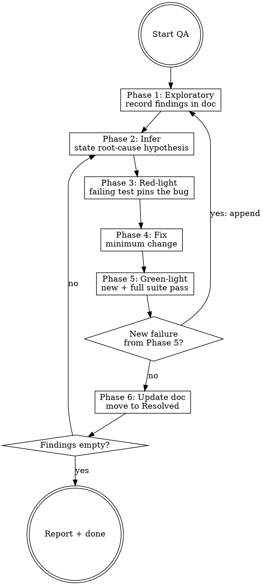

# Assuring Quality

Final QA pipeline.
Exploratory testing surfaces issues; TDD fixes them; loop until every discovered item is green.

The discovery doc is the single source of truth for progress.
If working memory disagrees with the doc, trust the doc.

## Phase 1: Exploratory Testing

Locate or create the discovery doc before probing anything.

1. Find the project's docs directory in priority order: `docs/qa/`, `docs/testing/`, `docs/`.
   Create `docs/qa/` if none of them exist.
2. Open or create `discover-qa-<YYYY-MM-DD>.md` in that directory.
3. Initialise it with this structure:

   ```markdown
   # Discover QA: <subject> — <date>

   ## Scope
   <what is being QA'd, version/branch, environment>

   ## Findings
   - [ ] F1: <observed behaviour> — <repro steps>
   - [ ] F2: ...

   ## Resolved
   <move completed items here with test name and fix commit>
   ```

4. Walk the primary user flows.
   Probe edge cases, error paths, boundary inputs, concurrency, permissions, data consistency.
5. Append every unexpected behaviour as a new finding immediately.
   Do not filter — record first, judge later.

Phase 1 is complete only when every observation is recorded in the doc and the planned scope is covered.

## Phase 2: Infer Bug Location

For the next open finding in the doc:

1. Read the relevant code paths.
   Trace from the observed symptom back through data flow to the suspected source.
2. State the root-cause hypothesis explicitly: module, function, condition that triggers it.
3. If multiple hypotheses survive, list them and pick the one with the cheapest disproving test.

Do not modify production code in this phase.

## Phase 3: Red-Light Test

1. Write the smallest failing test at a correct seam — a public boundary that exercises the real bug pattern as it occurs at the call site.
   If no correct seam exists, that is itself a finding: record it in the doc and flag the architecture.
2. Run it.
   The failure message must implicate the hypothesised location.
   If it does not, the hypothesis is wrong — return to Phase 2.
3. Commit the red test on the working branch before any fix.

No test framework available?
Write a minimal reproduction script and treat its non-zero exit as red.

## Phase 4: Fix

1. Apply the minimum change that turns the red test green.
2. One variable at a time.
   No drive-by refactors, no adjacent cleanups, no formatting passes.
3. If the minimum fix requires architectural change, stop and escalate to design.
   Do not patch around an architecture problem.

## Phase 5: Green-Light Verification

1. Run the new test — must pass.
2. Run the full test suite for the affected package — must pass.
3. A new failure surfaced?
   It is a new finding — append it to Phase 1 doc and return to Phase 2 for that finding.

## Phase 6: Update Discovery Doc

1. Move the resolved finding from `Findings` to `Resolved` with: test name, fix commit hash, one-line summary.
2. Any new findings discovered during Phases 2–5 stay in `Findings`.
3. Return to Phase 2 with the next unchecked finding.

## Termination

The loop ends only when `Findings` is empty.

Report at end:

- Total findings discovered
- Total resolved
- Any deferred items (with reason and owner)

## Hard Rules

- Red light must precede any fix. No exceptions.
- One finding, one fix, one commit. Do not batch.
- Three consecutive red→green failures on the same finding → stop, question the hypothesis or architecture. Do not attempt a fourth.
- New findings discovered mid-loop go into the doc immediately, never into memory.
- Phase 1 is not optional — even when the user already named a bug, exploratory pass first to catch related issues before fixing.

## Flowchart


