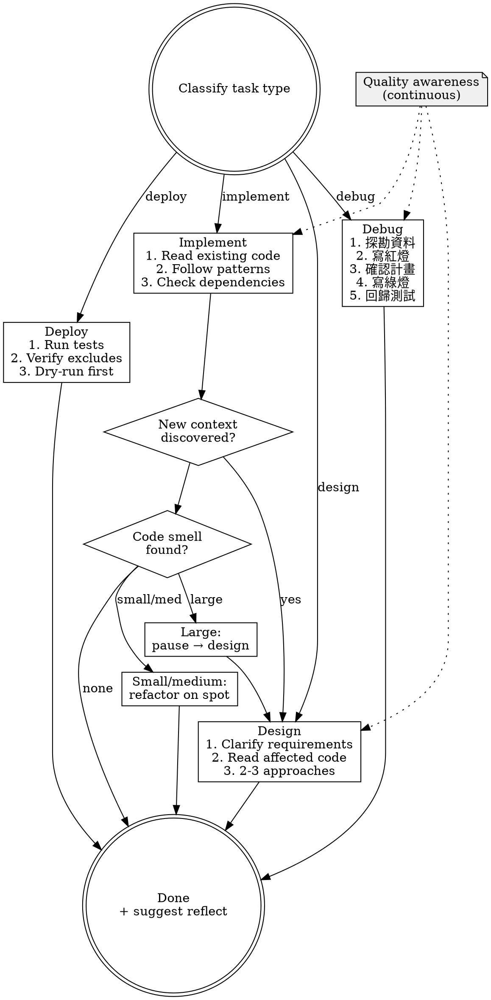

# Leveraging Tasks

## Routing

**Pattern:** owner-pipe
**Handoff:** auto-invoke (internal steps)
**Next:** `reflecting-to-root` (suggested at completion)
**Chain:** main

Classify the task, apply quality gates, delegate to project-level skills or execute directly.

## Step 1: Classify

Determine the primary task type from the user's request:

| Type | Signal |
|------|--------|
| **implement** | "add", "create", "build", "write", "integrate" |
| **design** | "architect", "plan", "design", "how should we", "what's the best approach" |
| **debug** | "fix", "broken", "error", "not working", "investigate", "why" |
| **deploy** | "deploy", "release", "push to prod", "ship" |

If ambiguous, ask one clarifying question. Do not guess.

## Step 2: Quality Awareness (All Pipes)

This is not an entry gate. Maintain this awareness throughout execution:

- File too large? (>300 lines → consider splitting)
- Function doing more than one thing? → split
- Mixed responsibilities in one module? → separate
- Small refactor opportunity? → do it now, don't ask
- Medium refactor (split file, extract module)? → do it, inform user
- Large refactor (architecture change)? → pause, go to design

## Step 3: Execute Pipe

### Implement

**Entry gate:**
1. Read target files and surrounding code. No exceptions.
2. Identify existing patterns. Follow them.
3. Check for circular dependencies in the planned approach.

**During execution:**
- Discovered new context that changes the approach? Pause, switch to **design**.
- Found code smell while editing? Small/medium refactor on the spot.
- Before finishing: self-review. Did you introduce any bad patterns?

**Delegate:** If project has an implementation skill → `REQUIRED SUB-SKILL: [project skill]` (model: sonnet)

### Design

**Entry gate:**
1. Requirements clear? If not, ask. One question at a time.
2. Read existing code in the affected area.
3. Prepare 2-3 approaches with trade-offs.

**During execution:**
- Existing code has smells that the new design would build on? Refactor first.
- Design would worsen existing problems? Adjust or refactor first.
- Output: design decision + list of pre-requisite refactors (if any).

**Delegate:** If project has a design skill → `REQUIRED SUB-SKILL: [project skill]` (model: opus)

### Debug

Five-step sequence. Do not skip or reorder.

1. **探勘資料**：重現問題、讀完錯誤訊息、trace data flow 找根因。不可重現就先補 logging/diagnostics，不猜。
2. **寫紅燈**：用最小的失敗測試釘住 bug。無測試框架就寫一次性 repro script。紅燈先於任何修正。
3. **確認實作計畫**：對使用者陳述 root cause + 修正方向 + 影響範圍，取得同意再動 code。
4. **寫綠燈**：最小改動讓紅燈變綠。一次一個變數，不夾帶 refactor、不順手改其他東西。
5. **回歸測試**：跑整套測試，確認沒連帶破壞。新 bug 出現 → 回 step 1。

**During execution:**
- Root cause 是架構問題 → 停，切到 **design**，不要貼 patch。
- 連續 3 次紅燈修不綠 → 停，質疑假設或架構，不要嘗試第 4 次。
- 調查中發現相關 smell？小/中重構就地做；大重構 → 切 design。

### Deploy

**Entry gate:** Apply all requirements in `~/.claude/rules/deployment.md`.

Deploy does not trigger refactoring. It consumes quality, does not produce it.

**Delegate:** If project has a deploy skill → `REQUIRED SUB-SKILL: [project skill]` (model: sonnet)

## Step 4: Completion

After the task is done:

1. If significant work was completed → suggest `/reflecting-to-root`
2. Otherwise → done

## Flowchart

