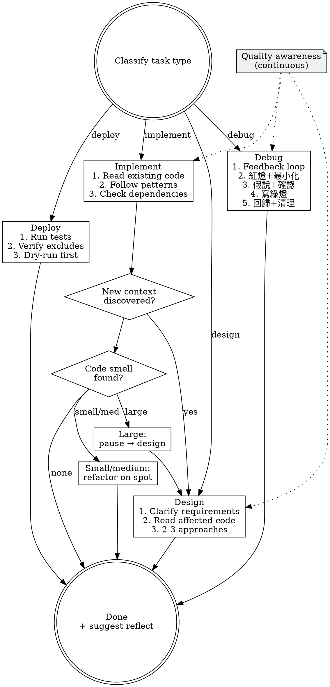

# Leveraging Tasks

## Routing

**Pattern:** owner-pipe
**Handoff:** auto-invoke (internal steps)
**Next:** `reflecting-to-root` (suggested at completion)
**Chain:** main

Classify the task, apply quality gates, delegate to project-level skills or execute directly.

## Step 1: Classify

Determine the primary task type from the user's request:

| Type | Signal |
|------|--------|
| **implement** | "add", "create", "build", "write", "integrate" |
| **design** | "architect", "plan", "design", "how should we", "what's the best approach" |
| **debug** | "fix", "broken", "error", "not working", "investigate", "why" |
| **deploy** | "deploy", "release", "push to prod", "ship" |

If ambiguous, ask one clarifying question. Do not guess.

## Step 2: Quality Awareness (All Pipes)

This is not an entry gate. Maintain this awareness throughout execution:

- File too large? (>300 lines → consider splitting)
- Function doing more than one thing? → split
- Mixed responsibilities in one module? → separate
- Small refactor opportunity? → do it now, don't ask
- Medium refactor (split file, extract module)? → do it, inform user
- Large refactor (architecture change)? → pause, go to design

## Step 3: Execute Pipe

### Implement

**Entry gate:**
1. Locate targets with codebase-memory-mcp first: `search_graph` to find symbols, `trace_path` for callers/callees; `index_repository` if the project is not indexed. Then Read target files and surrounding code. No exceptions.
2. Identify existing patterns. Follow them. Read `CONTEXT.md` and `docs/adr/` if they exist; use the project's domain language.
3. Check for circular dependencies in the planned approach.

**During execution:**
- Discovered new context that changes the approach? Pause, switch to **design**.
- Found code smell while editing? Small/medium refactor on the spot.
- Before finishing: self-review the diff on two axes, kept separate so one cannot mask the other — **Standards** (repo conventions + code smells) and **Spec** (the request or active OpenSpec change: anything missing, anything not asked for).

**Delegate:** If project has an implementation skill → `REQUIRED SUB-SKILL: [project skill]` (model: sonnet)

### Design

**Entry gate:**
1. Unresolved decisions in the requirements or plan? Run the `grilling` skill: facts are looked up, decisions go to the user one at a time, each with a recommended answer.
2. Read existing code in the affected area (`get_architecture` / `search_graph` first to map it, then Read). Read `CONTEXT.md` and `docs/adr/` if they exist; use the project's domain language.
3. Prepare 2-3 approaches with trade-offs.

**During execution:**
- Existing code has smells that the new design would build on? Refactor first.
- Design would worsen existing problems? Adjust or refactor first.
- Output: design decision + list of pre-requisite refactors (if any).

**Delegate:** If project has a design skill → `REQUIRED SUB-SKILL: [project skill]` (model: opus)

### Debug

Five-step sequence. Do not skip or reorder.

1. **建立 feedback loop**：先造出一個指令 — red-capable（釘住使用者描述的確切症狀）、deterministic、秒級、agent 可自跑。讀完錯誤訊息；呼叫鏈與影響範圍先用 codebase-memory-mcp 的 `trace_path`/`search_graph` 查，再讀檔。不穩定重現就先提高重現率（loop 百次、平行化、加壓），不猜。這個指令存在前，不建立任何假說。
2. **寫紅燈並最小化**：在正確的 seam（能重現真實 bug pattern 的 public boundary）把 loop 固化成最小失敗測試；無測試框架就寫一次性 repro script。紅燈後逐項刪減 repro，直到每個元素都 load-bearing。紅燈先於任何修正。
3. **假說與計畫確認**：一次列 3-5 個可否證假說，各附預測（「若 X 是因，改 Y 症狀應消失」），排序後連同修正方向 + 影響範圍給使用者，取得同意再動 code。驗證假說的臨時 log 一律帶 `[DEBUG-xxxx]` 前綴。
4. **寫綠燈**：最小改動讓紅燈變綠。一次一個變數，不夾帶 refactor、不順手改其他東西。
5. **回歸與清理**：跑整套測試，確認沒連帶破壞；grep `[DEBUG-` 清光所有 instrumentation；commit message 記下命中的假說。新 bug 出現 → 回 step 1。

**During execution:**
- Root cause 是架構問題 → 停，切到 **design**，不要貼 patch。
- 連續 3 次紅燈修不綠 → 停，質疑假設或架構，不要嘗試第 4 次。
- 調查中發現相關 smell？小/中重構就地做；大重構 → 切 design。

### Deploy

**Entry gate:** Apply all requirements in `~/.claude/rules/deployment.md`.

Deploy does not trigger refactoring. It consumes quality, does not produce it.

**Delegate:** If project has a deploy skill → `REQUIRED SUB-SKILL: [project skill]` (model: sonnet)

## Step 4: Completion

After the task is done:

1. If significant work was completed → suggest `/reflecting-to-root`
2. Otherwise → done

## Flowchart

