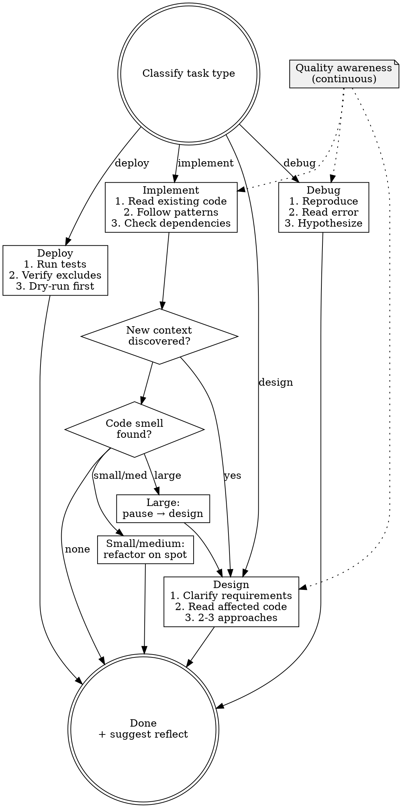

# Leveraging Tasks

Classify the task, apply quality gates, delegate to project-level skills or execute directly.

## Step 1: Classify

Determine the primary task type from the user's request:

| Type | Signal |
|------|--------|
| **implement** | "add", "create", "build", "write", "integrate" |
| **design** | "architect", "plan", "design", "how should we", "what's the best approach" |
| **debug** | "fix", "broken", "error", "not working", "investigate", "why" |
| **deploy** | "deploy", "release", "push to prod", "ship" |

If ambiguous, ask one clarifying question. Do not guess.

## Step 2: Quality Awareness (All Pipes)

This is not an entry gate. Maintain this awareness throughout execution:

- File too large? (>300 lines → consider splitting)
- Function doing more than one thing? → split
- Mixed responsibilities in one module? → separate
- Small refactor opportunity? → do it now, don't ask
- Medium refactor (split file, extract module)? → do it, inform user
- Large refactor (architecture change)? → pause, go to design

## Step 3: Execute Pipe

### Implement

**Entry gate:**
1. Read target files and surrounding code. No exceptions.
2. Identify existing patterns. Follow them.
3. Check for circular dependencies in the planned approach.

**During execution:**
- Discovered new context that changes the approach? Pause, switch to **design**.
- Found code smell while editing? Small/medium refactor on the spot.
- Before finishing: self-review. Did you introduce any bad patterns?

**Delegate:** If project has an implementation skill → `REQUIRED SUB-SKILL: [project skill]` (model: sonnet)

### Design

**Entry gate:**
1. Requirements clear? If not, ask. One question at a time.
2. Read existing code in the affected area.
3. Prepare 2-3 approaches with trade-offs.

**During execution:**
- Existing code has smells that the new design would build on? Refactor first.
- Design would worsen existing problems? Adjust or refactor first.
- Output: design decision + list of pre-requisite refactors (if any).

**Delegate:** If project has a design skill → `REQUIRED SUB-SKILL: [project skill]` (model: opus)

### Debug

**Entry gate:**
1. Reproduce the issue. If you cannot reproduce, say so.
2. Read the error message. Fully.
3. Form a hypothesis before changing any code.

**During execution:**
- Root cause is architectural? Switch to **refactor**, not a patch.
- Found related smells while investigating? Small/medium refactor on the spot.
- Before finishing: did the fix introduce new problems?

**Delegate:** If project has a debug skill → `REQUIRED SUB-SKILL: [project skill]` (model: opus)

### Deploy

**Entry gate:**
1. Run the project test suite. Stop if any test fails.
2. If using rsync --delete: verify exclusion of runtime files.
3. If Ansible on production: `--check` first.
4. Verify target directory exists and is non-empty.

Deploy does not trigger refactoring. It consumes quality, does not produce it.

**Delegate:** If project has a deploy skill → `REQUIRED SUB-SKILL: [project skill]` (model: sonnet)

## Step 4: Completion

After the task is done:

1. If significant work was completed → suggest `/reflecting-to-root`
2. Otherwise → done

## Flowchart

