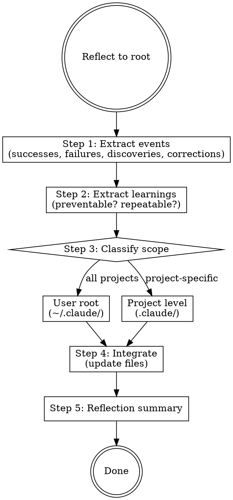

# Reflecting to Root

## Routing

**Pattern:** owner-pipe
**Handoff:** none (terminal skill — produces file edits)
**Next:** —
**Chain:** main

## Flowchart



Analyze what happened, extract learnings, classify scope, integrate.

## Step 1: Extract Events

Review the conversation for:

- **Successes:** patterns that led to good outcomes
- **Failures:** errors, wrong approaches, multiple attempts
- **Discoveries:** new insights about architecture/domain/tools
- **Corrections:** times the user corrected your approach

List each event with: what happened, why it matters.

## Step 2: Extract Learnings

For each event:

- What would have prevented this failure?
- What made this succeed that could be repeated?
- Does this apply beyond this project?

## Step 3: Classify Scope

For each learning, determine where it belongs:

```
Is this true across ALL projects?
├─ Yes → USER ROOT (~/.claude/)
│   ├─ Universal behavior → CLAUDE.md
│   └─ Convention/pattern → rules/*.md
└─ No → PROJECT LEVEL (.claude/)
    ├─ Project law → .claude/CLAUDE.md
    └─ Project convention → .claude/rules/*.md
```

### User-root signals:
- "This applies regardless of language or framework"
- "This is about how I work, not what I'm building"
- "This mistake could happen in any project"

### Project-level signals:
- "This is specific to this codebase's architecture"
- "This convention only makes sense here"
- "This is about this project's tools/stack"

## Step 4: Integrate

For user-root learnings:
1. Read current `~/.claude/CLAUDE.md` and relevant `~/.claude/rules/*.md`
2. Check: does an existing rule already cover this? → update, don't duplicate
3. If new rule needed → create or append to the appropriate file
4. Keep rules concise. One learning = one line.

For project-level learnings:
1. If project has rcc plugin → delegate to `rcc:reflecting`
2. If not → write directly to `.claude/CLAUDE.md` or `.claude/rules/`

## Step 5: Summary

```markdown
## Reflection Summary

### User-Root Changes
| Learning | Location | Action |
|----------|----------|--------|
| [insight] | ~/.claude/rules/X.md | added/updated |

### Project-Level Changes
| Learning | Location | Action |
|----------|----------|--------|
| [insight] | .claude/rules/X.md | added/updated |

### No Action Needed
| Learning | Reason |
|----------|--------|
| [insight] | already covered by [rule] |
```
